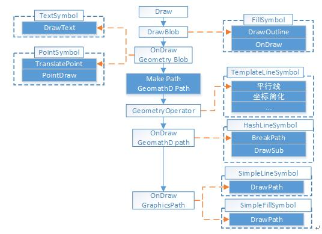
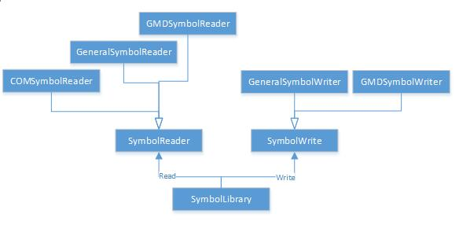

# GIS内核-符号模型 #
   符号属于GIS平台渲染能力的一部分，GeoStar平台在多年发展过程中已经形成了一套符号的体系，因此符号部分有必要作为独立的一个模块存在。同时符号在传统GIS领域和矢量符号具有相同的语义，在如今二三维一体化已经是GIS平台发展的一个必然趋势，因此符号也可以是三维符号或者二三维一体化符号。GIS符号的本质上是读取GIS几何数据，然后将几何数据转换成可以在画布上绘制的数据（点、线、面…）并绘制到画布上。

- 分类
- 

符号模块主要包含四个方面的内容:

1.	canvas，绘制画布的的抽象，可以实现二维矢量、图片的绘制，类似windows的HDC，canvas具有不同的实现版本，在GIS内核中主要实现基于QT绘制引擎的QTCanvas，在QTPort中实现。基于Agg开源绘制引擎的AggCanvas作为原生的实现存在，基于windows7的Direct2D技术封装的D2DCanvas在Win32Port中实现。

1.	DisplayTransformation，用于屏幕设备坐标和地图坐标的相互转换，完全复制于GeoStar的组件。

1.	符号对象，符号对象是一系列的对象构成，所有对象概念从GeoStar的符号组件迁移过来，功能上、命名上都和原有符号保持一致

1.	符号库对象，符号库是将符号保存为持久化数据或者从数据实例化为符号对象的对象，在GeoStar符号组件实现中采用了COM组件的序列化技术来持久化符号组件对象，但是在C++语言中，这样的技术难于实现。并且这样的技术也不利于扩展。因此在GIS内核实现中符号对象的持久化采用了访问者的模式，将符号的持久化实现为一系列的Reader和Writer。

- 运行流程   
- 
整个符号的绘制过程可以抽象为：

1.	绘制Geometry对象
2.	绘制Geometry Blob(几何的数据块)
3.	Blob创建为GeomathD的path
4.	处理Geometry的Path（优化或者改变几何数据）
5.	Geomathd Path转换画布上绘制的画布Path
6.	绘制或者填充画布Path

   除了第3和第5个过程，符号绘制的每一个过程都可以被继承符号基类的符号对象进行覆盖或者分流，正是因为对这些不同过程进行覆盖分流因此构成了符号绘制的不同结果。同时将符号的绘制过程简化为6个过程，相比原有GeoStar的符号对象，其过程已经非常简化，并且流程也足够清晰，通过这样清晰精简的过程理论上可以让GIS内核符号绘制效率提升。

- 符号库对象
-  

符号库是将一组符号对象序列化为一种数据格式持久化存储起来的对象，符号库是符号持久化存储的数据，符号库对象时用于符号库数据读写的对象。

符号库对象在读取符号和写入符号库的是否分别需要针对不同格式的数据采用不同的SymbolReader和SymbolWriter对象。
具体来说符号数据的Reader和Writer对象分别实现了三种和两种。

对于Reader来说供实现了三种Reader

1.  COMSymbolReader，用于将GeoStar符号组件基于XML格式存储的符号库读取。（基于COM二进制序列化出来的符号库在技术上无法做到读取）。
1.	GeneralSymbolReader是基于GIS内核的Config（配置）对象存储格式实现的符号库存储格式。
1.	GMDSymbolReader是基于GeoStar地图定义文件中符号库xml文件格式的读取

对于Writer来说提供了两种实现

1.	GeneralSymbolWriter，基于GIS内核的Config对象存储格式的符号写入格式
2.	GMDSymbolWriter，基于GeoStar地图定义文件写出的符号库格式。

**ByAuthor:yulei**
   

