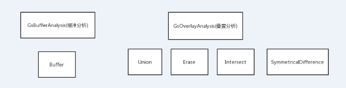

- 空间分析

空间分析是对于地理空间现象的定量研究，其常规能力是操纵空间数据使之成为不同的形式，并且提取其潜在的信息。空间分析是GIS的核心。空间分析能力（特别是对空间隐含信息的提取和传输能力）是地理信息系统区别与一般信息系统的主要方面，也是评价一个地理信息系统成功与否的一个主要指标。
空间分析分为缓冲分析和叠置分析，而叠置分析中包含合并，擦除，相交，异或

GsBufferAnalysis::Buffer()：在输入要素周围某一指定距离内创建缓冲区多边形。

GsOverlayAnalysis::Union()：计算输入要素的几何并集。将所有要素及其属性都写入输出要素类。

GsOverlayAnalysis::Erase()：提取与裁剪要素相重叠的输入要素。

GsOverlayAnalysis::Intersect()：计算输入要素的几何交集。所有图层和/或要素类中相叠置的要素或要素的各部分将被写入到输出要素类。

GsOverlayAnalysis::SymmetricalDifference()：输入要素和更新要素中不叠置的要素或要素的各部分将被写入到输出要素类。

**ByAutor:liuxianxiong**