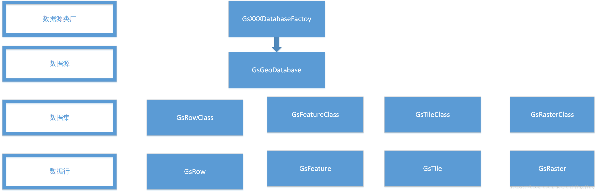
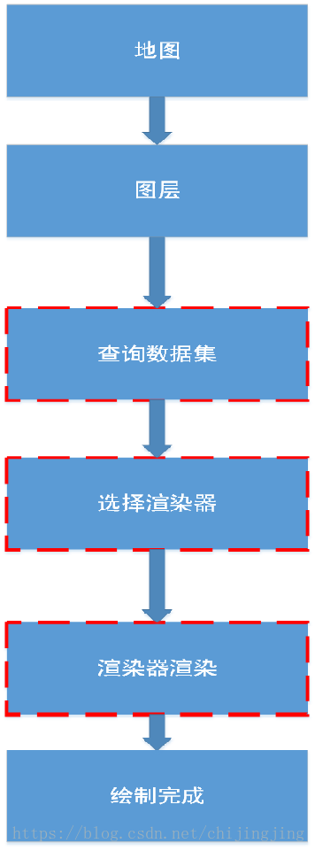

# GIS内核- 一些基本概念层次介绍 #
   对于很多没有做过GIS内核开发的同学而言,不是接口不会用,使用接口其实很简单,但是概念往往没有一个清晰易懂的解释,下面分为几个方面阐述基本的常用概念. 一共包含三个概念: 数据对象模型,数据源模型, 符号渲染模型,当然本篇不会讲很细节,仅仅作为一张图,每个使用和开发GIS内核的人应该熟悉并掌握.

- 数据源

这里首先介绍数据源, 数据才是任何应用的核心,数据源 是核心功能之一,它为各种应用提供读写接口,是最基础得接口之一.

要使用使用数据源必须要有以下层次概念:

数据源用来管理各种基础的数据集,抽象概念上目前有各种基础的数据集:  矢量地物类, 瓦片数据集, 栅格数据集, 二维表数据集. 具体如何得到各种数据集的数据后续将详细说明.

- 数据模型   
将分别介绍各数据集的数据行对象模型,分别为:GsRow,GsFeature,GsTile,GsRaster

GsRow: 二维表数据集内一行数据,主要存储基本的属性数据,  数据源不管里面存储的是什么,如同数据库的一个基础表,里面只有一个固定列数据,ID ,其他为用户自定列.

GsFeature: 和二维表有一定区别,多了一列单独的类型:几何类型.  其他列属于用户自定义.

GsTile: 瓦片对象模型, 瓦片为将特定区域(一般是全球范围,也可是其他范围)数据按照不同分辨率(分层)分块 切割 存储(行列),

 所以单个瓦片对象模型 基本属性有层,行,列,切割后的数据块. 目前常用的数据块有栅格化的图片,矢量切割的pbf.

常用分块大小为256*256 像素,和512*512像素. 分层策略采用四叉树分层策略(即上下两层分辨为2倍关系)

GsRaster: 此为栅格数据集某一块范围的栅格数据 ,即特定宽高的二进制数据, 常见的二进制数据为RGB 颜色数据和高程数据.(简单理解就是一个大的栅格数据集下扣出来一块范围的数据).

- 渲染模型 

 前面介绍了一堆数据源, 可以获取很多种数据,这里将介绍渲染模型.一个基本的渲染将走以下模式. 

前面介绍的四种数据集二维表数据不具备表现能力,瓦片数据集 如果存储的是栅格瓦片(图片)那么渲染器也很简单,直接绘制图片.   

栅格数据集直接绘制像素.唯一较为复杂的为矢量地物类数据集. 他的渲染的需要根据不同的矢量数据和配置的符号做对应的渲染:

这里面最重要的概念模型为GsFeatureRenderer和GsSymbol.   

GsFeatureRenderer和GsSymbol.都为抽象概念, 一个基本得到绘制流程和操作系统的关联流程如下:

1. GsFeatureRenderer 通过DrawCursor 将数据集的数据提供给GsSymbol.

2. GsSymbol 内部将矢量的几何数据转为 操作系统认识的屏幕像素能绘制数据 ,比如GDI+的GraphicsPath或者是QT的QPainterPath

3. 调用系统函数绘制到屏幕.

以上就是一个基本的GIS内核常用的几种模型. 当然这里还只是很粗浅的略讲了一遍, 详细的后续有时间再做细致说明. 

另外GIS内核还支持java C# py,lua 等接口开发.
