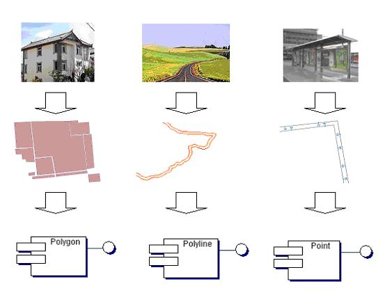
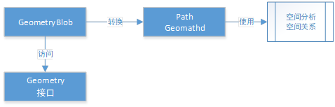
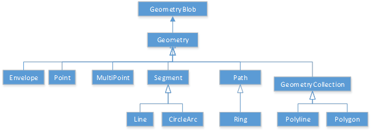
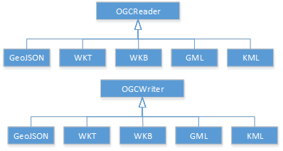

# GIS内核-几何对象模型 #

空间几何对象用于描述空间实体具有的几何和定位信息。典型的如房屋，道路，公交站等具有空间定位和几何特征的地理实体，使用 GeoStar 的空间几何对象模型可以把他们分别构造为房屋多边形（面），道路线（线）和公交站点（点）。使用空间几何对象模块可以对构造完成的几何对象进行空间几何处理形成新的几何对象。譬如，生成道路周围 200 米范围缓冲区，检索在此缓冲区中的所有房屋和公交站。

- 几何对象模型设计

几何对象模型从GeoStar的几何对象模型对象继承而来，在GIS内核概念中，Oracle的三元组数据结构将作为几何对象的核心数据结构。这个数据结构在几何对象模型中定义为GeometryBlob。如下图所示GeometryBlob是几何对象的核心数据结构，GeometryBlob也是任何一个Geometry实际存储的数据内容。

 

依据这样的设计，GIS内核中的Geometry对象将非常利于数据存储，当数据读取的数据创建为Geometry数据的时候，几乎不需要什么代价就可以实现Geometry对象创建，而Geometry只有进行空间分析等功能时才动态转换为GeomathD的path进行分析。这样的方法可以很大程度上提高Geometry的操作性能。因此再数据源中就不需要像现有GeoStar的组件一样为显示设计专有的非对象化接口来减少性能消耗。
Geometry的几何数据格式转换采用专有的数据Reader和Writer方式实现，如此做法利于Geometry扩展多种类型的数据格式。

- 模块划分

这里首先介绍几何对象的各个模块，

|名称|集合类型|描述
|:-|:-|:-|
|点| Point |单点。
|多点| MultiPoint |多点。  
|线|Line |线，如不通过同一个点两次，则为简单类型。
|弧线|CircleArc |圆弧线，可以通过任意不在一条直线上的3个点来确定一个圆弧线。
|圆|Ring|圆
|折线| Polyline | 由多条线段组成折线，不封闭。
|多边形| Polygon | 有多条线段组成的多边形。 

- 几何数据格式读写

   GIS几何对象具有非常多样的数据存储格式，以OGC标准就有WKT，WKB，KML，GML等，还有GeoJSON等也是常见的几何数据存储格式。这些数据存储格式可用于和第三方库或软件交换数据，因此在GIS内核中具有非常重要的地位。

   对于各种GIS数据存储格式非常丰富，存储方式也非常多样化，因此对于这些几何格式的读写，在GIS内核中并没有采用类似对象序列化的机制是实现，因为这样让比较复杂的几何对象更加复杂。在GIS内核中，几何数据格式的读写采用访问者的模式。将几何对象Geometry放到一个Writer中可以实现写出一种特定几何数据格式的目的，通过一种Reader可以将一种特定的数据格式读成Geometry对象。

   对于几何对象的Reader而言，基类OGCReader并非完全抽象，基类OGCReader实现了大部分的OGC几何对象相关的内容，对于具体继承OGCReader的某种特定格式的对象则专注于解析该特定格式。

   考虑到GML，KML存在多个版本的区别，将来可以根据需要扩展针对不同版本的GML、KML的Reader。

   对于几何对象Writer其设计原理与Reader类似，在基类OGCWriter中实现了大部分的公共内容，而对于实现具体格式的某个类则专注于该格式的写入。

**ByAutor:wuyongbo**