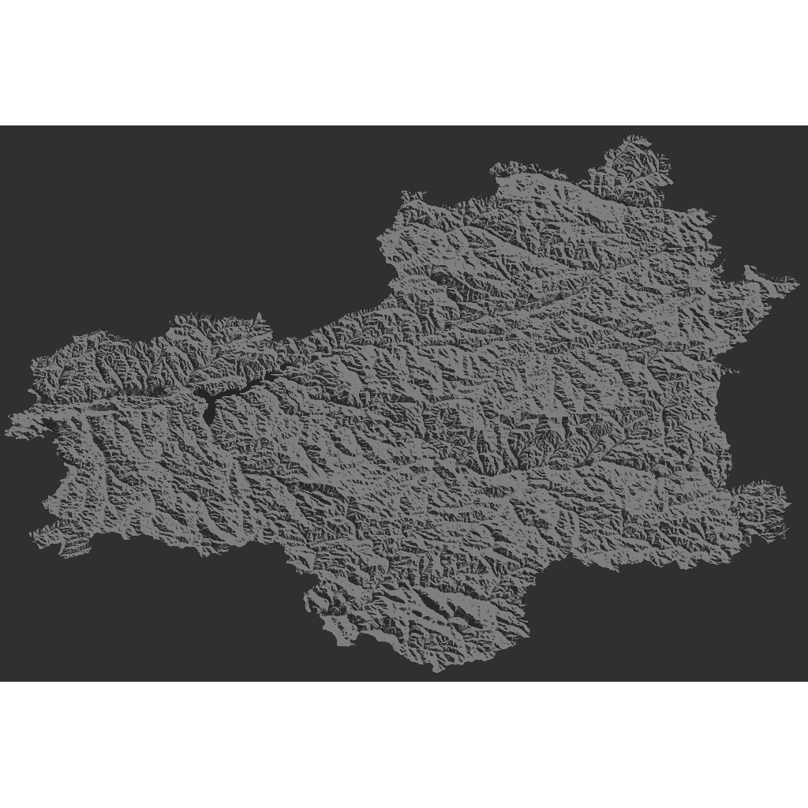
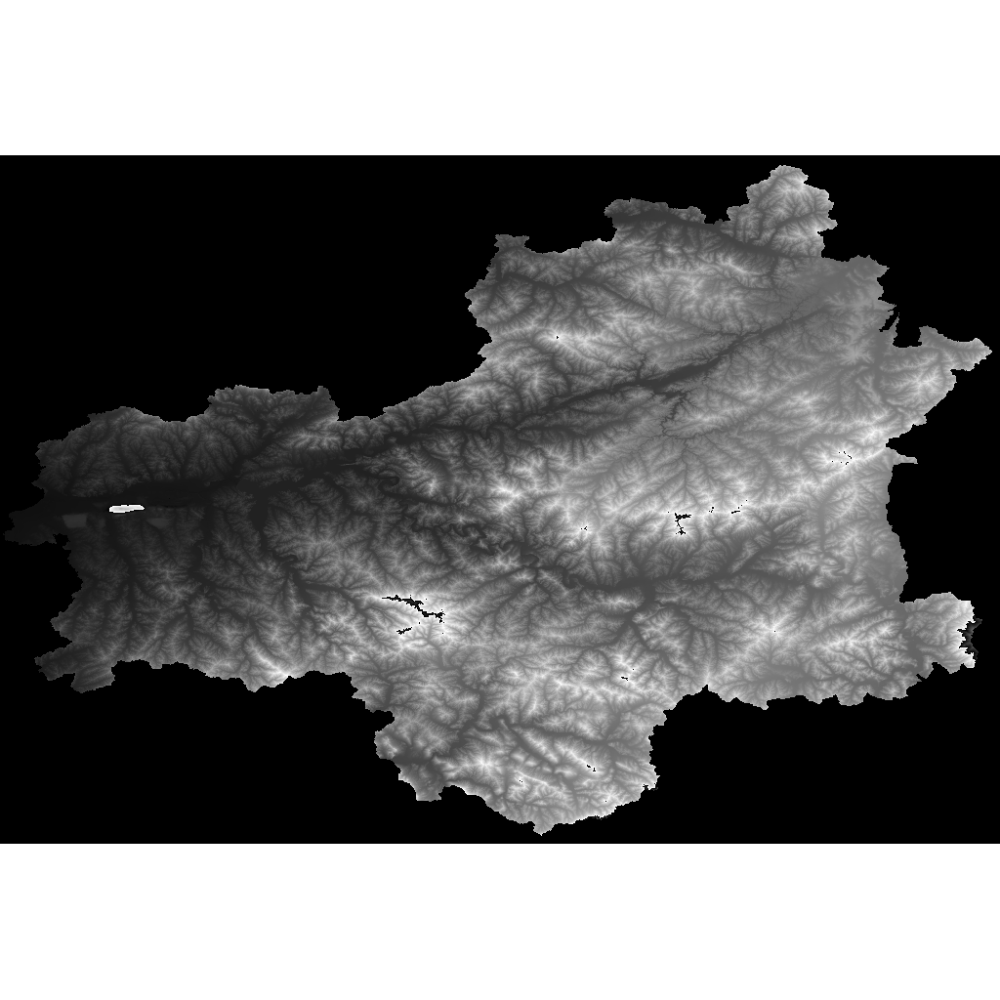
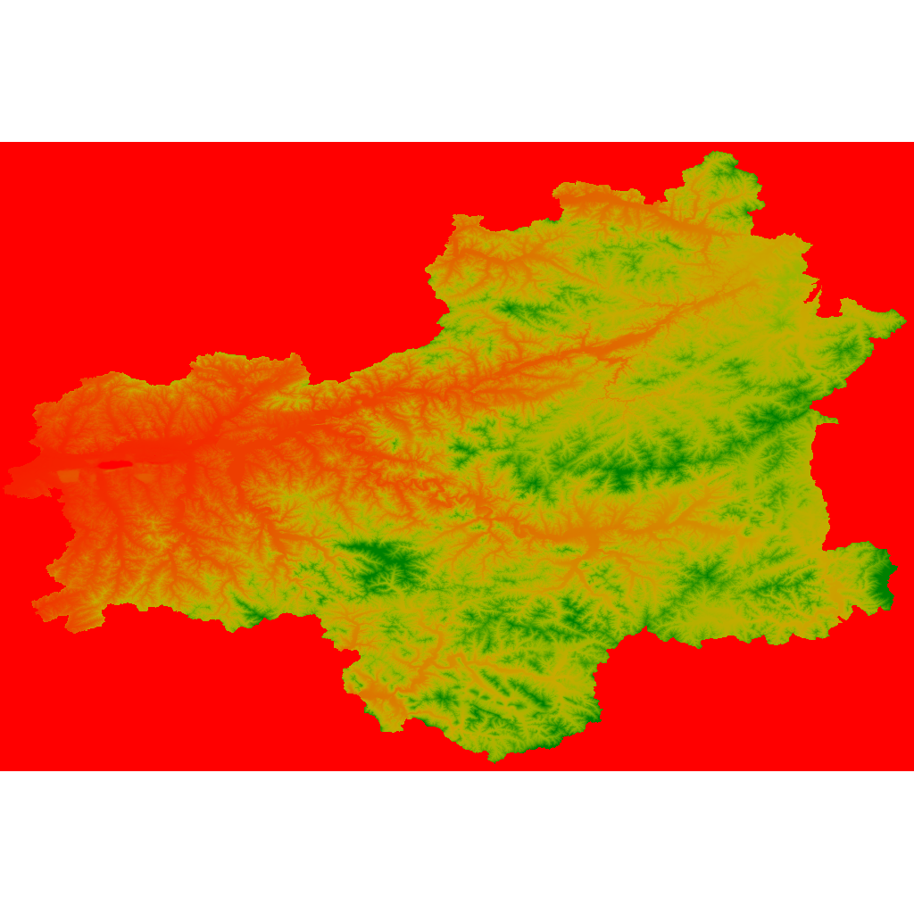
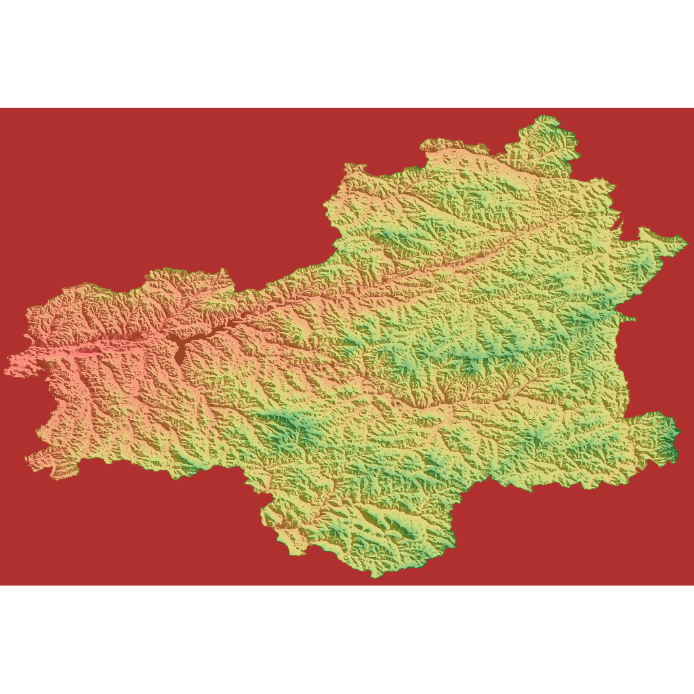
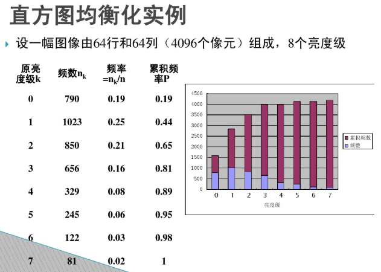
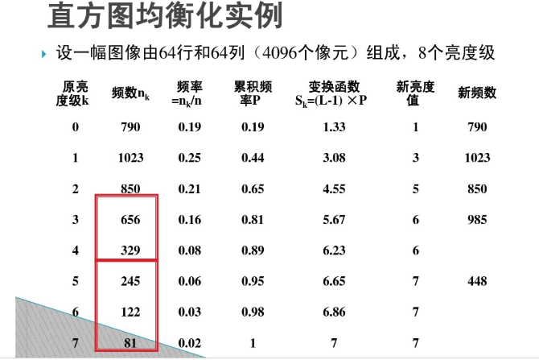

地形渲染
===

目前，内核地形渲染实现4种模式，基本与ArcGIS保持一致。

##地形渲染分类

###1.默认渲染（默认构造函数）：即为基本的灰度渲染。

###2.灰度渲染+山体阴影：参照ArcGIS界面的灰e 度色带，勾选ushillshade。

代码示例：

GsTerrainRendererPtr ren = new GsTerrainRenderer();

ren->UseHillShade(true);

ren->HillShadeData(45, 315);

###3.彩色DEM（渐变色和Count构造），参照ArcGIS界面设置Color Ramp。

代码示例：

GsFormulaGradsColorPtr fc = new GsFormulaGradsColor(GsColor::Red, GsColor::Green);

fc->Style(GsFormulaGradesColorStyle::eHSVFormula);

GsTerrainRendererPtr ren = new GsTerrainRenderer(fc, 8);

###4.彩色DEM+山体阴影：参照ArcGIS设置Color Ramp。

代码示例：

GsFormulaGradsColorPtr fc = new GsFormulaGradsColor(GsColor::Red, GsColor::Green);

fc->Style(GsFormulaGradesColorStyle::eHSVFormula);

GsTerrainRendererPtr ren = new GsTerrainRenderer(fc, 8);

ren->UseHillShade(true);

ren->HillShadeData(45, 315);

##地形渲染实现过程

每一个render里，在CreateColorTrans时会构造一个ColorToRGBA，地形渲染的实现基于派生类DEMToRGBA。

DEMToRGBA会根据m_useHillshade的true或者false，由原始栅格Raster生成一个新的具有阴影效果的Raster，根据渐变色对象m_GradColor存在与否，由原始栅格Raster计算形成一个具备彩色效果的Raster。

如果渐变色绑定的同时，再使用阴影效果，则最终生成的Image由阴影Raster和彩色Raster叠加，叠加过程每个像素值由混色计算方法（MixedColor）得出。

在由原始栅格生成新栅格的过程依赖于RasterProcess处理对象。

###阴影的计算过程

阴影的生成采用一般3*3网格的处理方案，构造对象GsGeneric3x3Process，在处理过程中，每移位一次，则由当前栅格的8个邻域，构造一个3*3的滑动窗口，由此3*3窗口计算阴影。

特别的，图像的边界部分（首尾行，每行的首尾栅格），以为其领域不足以构成3*3邻域，赋以无效值处理。

阴影值的计算，即模拟一定强度，一定方向的太阳光线（平行光）入射具有一定坡度（slope）坡向（aspect）的地面，因为灰度范围为0-255，所以太阳光线的强度满值为255，通过投影，计算出每个栅格的光照强度。

从图像的表现效果来看，则暗色表示阴影，白色表示光照充足。

###彩色DEM的计算过程

彩色DEM的实现过程，首先由渐变色对象和Count生成一定数量的颜色数组，其次根据Count，对栅格值（高程值）分级，一共分为Count个区间。对每一个栅格值，根据二分查找其所处的级层（上下边界），按照级层从颜色数组中取色。

取色的过程取决于取色模式GsColorSelectionMode，其中枚举了三类取色方案，1是根据栅格值在所处的上下边界中，对此上下边界的两个颜色，进行RGBA线性内插，赋予新栅格颜色值，2是选择与当前栅格值最为接近的边界颜色，3是选择与此栅格值精确相等所对应的颜色。

##灰度拉伸实现过程

首先灰度拉伸分为几类，其中最大最小值拉伸和标准差系数拉伸原理相似，主要基于灰度转换对象GrayToRGBA实现。

最大最小值拉伸，即将原始栅格的高程空间直接映射到新的最大最小值空间中。标准差系数拉伸则根据原始高程的标准差和平均值信息计算新的最大最小值，同样将原始栅格值再映射到此空间中。

内核的实现，即在RasterRender对象中存储原始栅格的统计数据和所需要的拉伸数据StrectchData：

即调用：void Strectch(const StrectchData& pStrectchData);拉伸数据包含拉伸类型，拉伸空间的最大最小值，拉伸的标准差系数。

每次在DrawCurse函数中对这些统计数据进行更新（调用UpdateStatistics函数），更新的同时最拉伸数据中，拉伸空间的最大最小值重新计算。

然后在创建颜色转换对象时（CreatColorTrans），设置GrayToRGBA的max和min，在Translate生成Image时对栅格值进行映射。

其余类型的拉伸则基于直方图实现，暂未实现，原理也很简单，但是计算量比较大，有需要以后可以接着做。如直方图均衡化为例，首先需要统计灰度图中每种灰度值出现的累积频率（灰度级从小到大排序的累积频率）。

然后，通过变换函数计算每个栅格的新值，通过新值，取在所有灰度级中的临近对应的灰度级，作为新栅格的灰度值。

