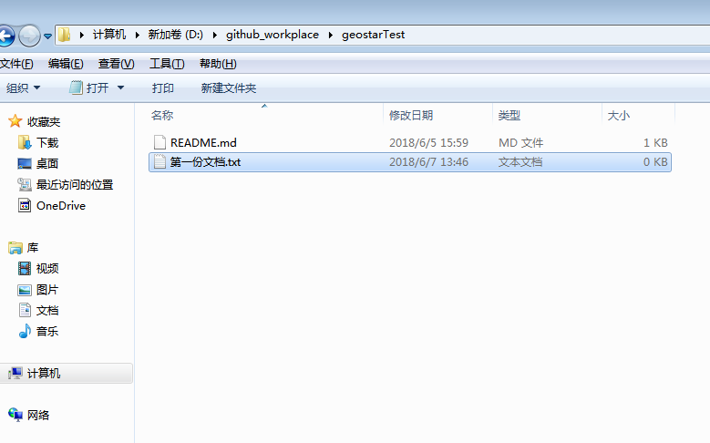

* 第一步先下载安装包：[GitHubSetup.exe](/uploads/d0f3edcd63c77f74915abdee61d8abb0/GitHubSetup.exe)，然后到github官网注册https://github.com/login      注册的邮箱统一为我们的公司邮箱，安装好后有两个图标，一个windows版，一个命令行版，图标是这样的
* 第二步大家把用户名告诉我，我会统一邀请大家到一个项目中来，到时候大家会在web的右上角的位置看到消息通知点击进去accept我的请求就行。但是消息通知默认是不显示的，需要自己开启，参考网址http://www.cnblogs.com/liuleilei/p/6486665.html    这个网址的 【三、工具栏  第 6 个图标 】详细介绍了开启消息通知的方法。 强烈建议大家把这个网址的每个图标，每个英文单词代表什么意思了解一下，学习一下

* 第三步打开自己的github客户端，登录自己的账号密码，点左上角的+号——clone——项目名——clone项目名  会弹出需要保存的路径，选择自己的路径保存到本地即可。

### 如何上传自己的成果？
比如在本地自己的项目路径下新增了一份文档叫“第一份文档.txt”，那么打开github客户端找到刚刚的项目——changes——commit to master，此时并没有真正提交到云端，还需要点击一下右上角的Sync才能将提交的东西同步到云端。此时，打开网页版就能看到我们刚刚提交的东西。

### 怎么解决冲突？
建议在每次工作时先点一下右上角的Sync同步一下，尽量避免产生冲突，如果提交代码时，commit to master是肯定能成功的，然后同步Sync的时候发现失败了，也就是出现下面页面，

那么我们应该怎么解决提交代码的冲突呢？
关掉上述同步失败的界面，你会发现在“第二份文档.txt”后面有个黄色小叹号，这时冲突标志，说明我们这个文档不是在云端最新基础上改的，这时就需要合并，如图

本地做完合并的“第二份文档.txt”的内容如下图

然后再次回到github客户端，点击commit to master——Sync就可将合并的文档提交到云端。

* github客户端切换用户的方法https://www.jianshu.com/p/0ad3d88c51f4
* shell 上传代码https://blog.csdn.net/lanuage/article/details/56331800
* 更新代码https://blog.csdn.net/and_rew_xu/article/details/43999007

### 如果在一开始更新代码，也就是点Sync出现冲突，也就是出现如下页面，应该怎么办

出现这个原因是因为你没有在最新代码基础上改，改完又没有及时传到云端，所以会有两个版本，所以会提示你说，会覆盖你未提交的版本，这个时候你会发现自己的changes一定有未提交的内容，这时的处理方法是将自己的版本保存为别的名字，然后再Sync一下，然后再对比。

# 如果你喜欢用命令行版，也就是github shell，下面是教程
## 第一步：登录
在开始之前要先学会用“鱼竿”，打开Git Shell输入下面指令：git --help，可以获取命令指南，里面列出了一些基本的操作和说明。可以参考。
在一个项目中如果很多人都用Git工作，是需要识别每个人机器的，因此用以下代码登陆你的机器。
* git config --global user.name "Your Name"
* git config --global user.email "youremail@example.com"

其实，如果你已经用桌面版登录过了，这步可以省略，会自动识别当前用户的，你可以使用下面命令来看看 当前登录的用户名是什么：

查看用户名和邮箱地址：
* git config user.name
* git config user.email

修改用户名和邮箱地址：
* git config --global user.name "username"
* git config --global user.email "email"

## 第二步：下载代码到本地
接下来就可以将云端代码下载到本地，命令是git clone 空格 加上云端的地址 空格 再加上本地的路径。比如
  * git clone https://github.com/wangerlan/test-ck.git D:/a

## 第三步：本地项目和服务端项目关联
因为我们只是clone了服务器的项目到本地，后面需要提交新文件和文件改动到服务器的话，需要将本地的项目和服务端关联起来：
利用cd命令切换到项目目录下，然后执行 
* git remote add origin https://github.com/wangerlan/test-ck.git

上面三步就可将环境配置好，下面说代码的上传下载。

### 怎么上传代码到云端：

1. 利用cd命令切换到项目目录下
2. git pull origin master //pull代码到本地
3. 利用命令 git add . （注意后面有一个点，代表将本地项目工作区的所有文件添加到暂存区） 
4. 利用命令 git commit -m “注释” 将暂存区的文件添加到本地的代码库中 
5. 将本地仓库上传到云端      git push -u origin master

### 怎么下载代码到本地：
就一句话  git pull origin master //pull代码到本地

### 合并分支
上面windows版一般情况是够用了，但是合并分支不是特别方便，我反正是一直没有找到合并分支的按钮（merge），如果需要合并分支，建议下载github desktop，安装包太大传不上来，有需要找我要，安装好的图标是这样的，

* 打开页面后 点branch——create branch 就可建立新的分支，比如创建了geostar_B分支，然后这个分支新增了个文件叫“B.txt”,如图
!

* 然后切换到github desktop会发现changes图标已经检测到我们新增了“B.txt”，此时我们需要先把这个改变提交到geostar_B分支，然后 push origin到云端，这样的话云端也就同步了B分支的信息

* 然后B分支和主分支做合并，点击Branch ——merge to current branch 会弹出一个窗口，如下图，选中geostar_B分支，然后点击merge to master，然后就会回到主界面，此时只是在本地合并了，仍然要记得 push origin到云端，这样才算真正的合并B到master完成

* 验证B分支和master是否相同，点击Branch —— Compare on Github，就会弹到web，出现如下界面说明B分支和master此时完全一致

